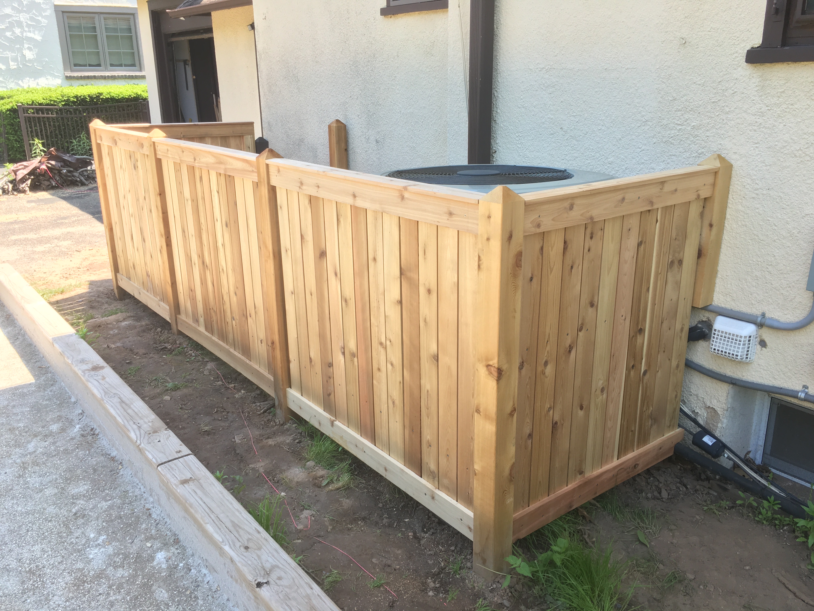
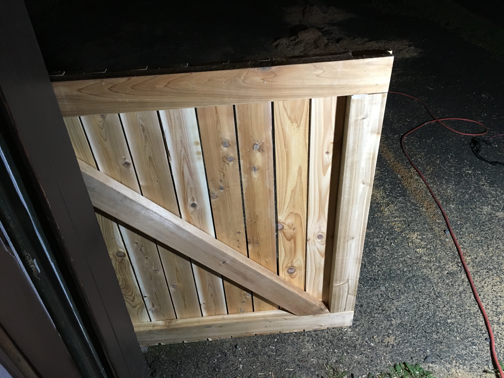

&copy; 2019 Jason Luther. All rights reserved. 

# DIY Removable Fence

We live on a corner, so half of our yard space is exposed to the public. We also built a bocce court alongside the house. For those reasons, we wanted to build a fence to cover our air conditioning equipment. This is also where we keep our garbage cans and recycling bins. 

The challenge was to build something that would still allow for easy servicing of the equipment. Our solution was to build a fence with removable panels. 

The project is pretty much the same as building a fixed fence. The secret is to use [fence brackets](https://amzn.to/2CJhUR0) and leave out some of the screws. 

### Be safe

Any construction project can be dangerous or fatal, so please take appropriate safety precautions and consult a professional when you need help. 

Use a respirator when cutting wood, especially if it's pressure-treated. Use hearing protection when using power tools. Always wear safety glasses. 

I am not a professional, and I am just sharing my experience for information and entertainment purposes. I cannot be held responsible for any damage or injuries that result from actions you take. 

### Steps

These are the steps:

1. Prepare the posts and set them
2. Mount brackets and horizontal boards
3. Attach pickets
4. Add top and bottom
5. Make gate

## Materials and Dimensions

Our fence is built from cedar. It's lightweight and great for outdoor projects. While cedar can sometimes be expensive relative to pressure-treated pine, siding and fence boards are often cheaper because they're knotty and only surfaced on one side. 

Cedar ages nicely and doesn't require painting or staining. 

The fence pickets are knotty green cedar 1x4s that are surfaced on one side and rough on the other. I ran mine through the planer, but it wasn't really necessary. 

The horizontal supports and gate frame are made from cedar 2x4s. 

The posts are cedar 4x4s, installed with "no mix" post cement. 

Everything is attached with 2" or 1-1/4" stainless steel screws. If you use pressure-treated wood instead, choose compatible screws. 

The key components are [fence brackets](https://amzn.to/2CJhUR0) that are attached to the post to hold each fence section. They are similar to joist hangers. The 2x4 horizontal boards just rest in the brackets instead of being screwed in like they would be in a standard fence. 

You can make the fence any size you need to suit your purpose. Ours has 1 gate and 4 separate sections. The sections are about 44" tall and 50" wide, but the exact dimensions will be determined by where you have to place your fence posts. 

### Sources

I have included links to some of the materials and tools I used. Some of those are affiliate links, so I may earn a commission on purchases made through those links. 

However, I would much prefer if you bought these things from a local supplier instead of Amazon. With any DIY project, you're likely to make multiple trips to the store, and you're going to want advice from experts. 

None of this content is otherwise sponsored.

## Tools

Depending on the dimensions and how fancy you want to get, this build can be done with a saw and a drill/driver. 

However, I used a miter saw to cut the wood and to bevel the post tops, a table saw to rip some of the pickets and bevel the top boards, and a [surface planer](https://amzn.to/2B3Inss) to smooth the pickets. 

To attach the top boards, I used a pocket hole jig. You could also use glue or drive screws from the top, or you can leave out the top boards. 

Here are many of the tools I used. Some of my tools are older and these links may be to newer models or similar items. 

 * [Drill](https://amzn.to/2ymaIIh)/[driver](https://amzn.to/2ymm27v)
 * [Circular saw](https://amzn.to/2IHGRyX) or [miter saw](https://amzn.to/2Tinnp0) for cross cuts
 * [Table saw](https://amzn.to/2ThrXnv) for rip cuts
 * [Pocket hole jig](https://amzn.to/2My2p2K) and [screws](https://amzn.to/2WjTd6R) to attach top boards
 * [Speed square](https://amzn.to/2yhrnN2), a guide for making circular saw cuts and squaring up joints
 * Clamps to hold pickets in place before they're screwed in
 * [Level](https://amzn.to/2Wigaat) and [post level](https://amzn.to/2FSwQjW)
 * [Tape measure](https://amzn.to/2MxqruF)
 * [Post hole digger](https://amzn.to/2G27ak0)
 * Bucket for water for post cement
 * Safety
   * [Ear protection](https://amzn.to/2OZ2du3)
   * [Safety glasses](https://amzn.to/2NMfDNc)
   * [Respirator](https://amzn.to/2NsngU4) with [3M 2097](https://amzn.to/2C1Dh1c) cartridge

## Posts

The post locations and height are going to depend on your situation. 

To keep water from pooling on top, I used my miter saw to bevel all four edges. 

The biggest challenge is to get the posts to be in a line with each other and to be the right height. I wish you the best of luck. As Jimmy Diresta reminds us, [if it looks straight, it is straight](http://shop.jimmydiresta.com/version-2-diresta-letterpress-poster-if-it-looks-straight-it-is-straight/). 

Initially, I laid out the posts to only surround the A/C condensers. But then I decided to add another post so we could store our garbage cans within the fence. I was able to reuse an existing post from the old garbage can area. It doesn't match, but I can live with that. 

On the other end, I attached the "post" to the house. Existing pipes and wires running to the A/C gear required some creative layout. 

## Brackets

With the posts set, the next step is to mount the brackets and install the 2x4 horizontal boards that the pickets will be attached to. 

The position of the horizontal supports is not really critical. 

## Pickets

The pickets will be attached to the supports. Based on the width of the posts, roughly lay out the pickets to figure out how much space you want between each one. If the spacing isn't even, you'll need to rip down the side pickets to make everything fit. 

In my fence, one section needed the side pickets to be cut, but the rest didn't. 

I ran each picket through the thickness planer to make each side smooth. That allowed me to pick the better-looking side as I arranged things. This was totally unnecessary, but if you've got a planer, you might as well enjoy it. 

The pickets are attached to the top and bottom 2x4s with 2" stainless steel screws. 

## Top and Bottom

You could stop after adding the pickets, but I did a few things to make the fence fancier. I added a horizontal piece to the top and bottom of the fence panel using the same 1x4 material, and then I added a top piece that I beveled on using the table saw to try to keep water from pooling. 

The top pieces were attached using pocket screws. If you're going to do this, you will want to drill the pocket holes before you attach the pickets. Alternatively, you could screw them down from the top or nail them. 

## Gate

The last step was to add a gate for the garbage and recycling. 

The gate frame is made from 2x4s with half-lap joints that I cut on the table saw and then glued and screwed together. To keep the frame square, I added a diagonal support. Then I attached pickets and the rest of the decorative boards. 

Finally, I attached the gate hardware. 

